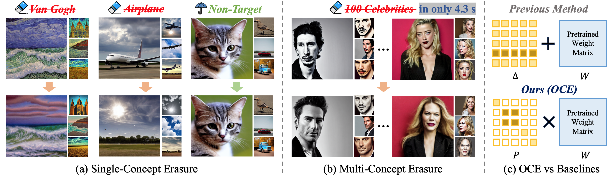

# Orthogonal Concept Erasure for Diffusion Models
<p align="center">
  <a href='https://arxiv.org/abs/2605.28902'>
    
  </a>
</p>

Official implementation of [Orthogonal Concept Erasure for Diffusion Models](https://arxiv.org/abs/2605.28902).

## Setup
To get started:
```bash
git clone https://github.com/HansSunY/OCE.git
cd OCE
pip install -r requirements.txt
```
## Concept Erasure with OCE
### Compute the generic preservation term $C_g$

```bash
python compute_Cg.py
```
### Closed-Form Concept Erasure
We provide scripts for object, style, celebrity (multi-concept), and nudity concept erasure in the `trainscripts` directory. You can directly run the corresponding script for erasure, for example:
```bash
bash trainscripts/celeb_100.sh
```

### Image Generation
We provide sampling scripts for different erasure scenarios in the `evalscripts` directory. For example:
```bash
bash evalscripts/generate_celeb.sh
```
## Metrics Evaluation
- Evaluate FID:
```bash
python metrics/eval_fid.py --input1 'path-to-generated' --input2 'path-to-original'
```
- Evaluate CLIP Score:
```bash
python metrics/eval_clip_score.py --image_dir 'path-to-generated' --prompts_path 'data/coco_30k_val.csv'
```
- Evaluate Celebrity Erasure
For celebrity evaluation, we follow MACE's setup by introduing GIPHY Celebrity Detector (GCD). Please refer to the [GIPHY Celebrity Detector Installation Guide](https://github.com/Shilin-LU/MACE/tree/main/metrics).
```bash
python metrics/eval_celeb.py --image_folder 'path-to-generated'
```
- Evaluate Nudenet Detection
```bash
python metrics/eval_nudity.py --image_folder 'path-to-generated'
```
- Evaluate CLIP Classification Accuracy
```bash
python metrics/eval_nudity.py --image_folder 'path-to-generated'
```